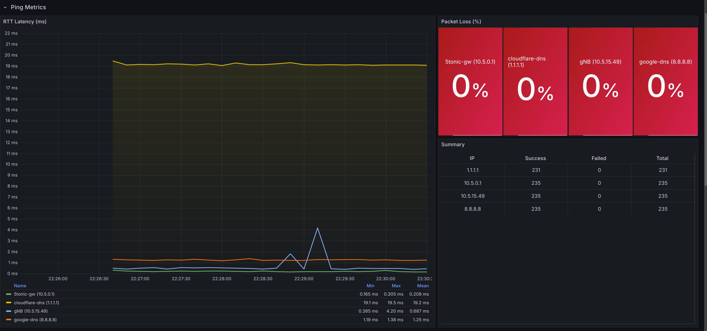

# Kafka-Docker-MM2

This repository provides an example of synchronizing a distributed Kafka environment using MirrorMaker 2 (MM2). The deployment leverages MM2 to replicate data between Kafka clusters. MM2 runs as a standard Kafka broker with a modified entrypoint configured via `mm2.properties`.

This setup uses Kafka with RAFT and includes Kafka-UI for monitoring. It is based on Bitnami Kafka instead of Confluent Kafka and follows the approach outlined in [this guide](https://medium.com/larus-team/how-to-setup-mirrormaker-2-0-on-apache-kafka-multi-cluster-environment-87712d7997a4) with modifications.

## Project Structure
- `edge/` - Scripts for managing the Kafka instance at the edge (D6G site).
- `producer-consumer/` - Example Python-based Kafka producers and consumers.

## Quick Start

### Start Infrastructure Monitoring with Edge Kafka instance
```bash
cd edge
./start_infrastructure_monitoring.sh --local-ip 10.5.1.21
```

- Kafka UI: [http://10.5.1.21:8080](http://loca10.5.1.21lhost:8080/)
- Grafana Dashboard: [http://10.5.1.21:3003](http://10.5.1.21:3003/)
- InfluxDB UI: [http://10.5.1.21:8088](http://10.5.1.21:8088/)

### Stop Infrastructure Monitoring
```bash
./start_infrastructure_monitoring.sh
```

---

### Grafana credentials

- User: `desire6g`
- Password: `desire6g2024;`





---

## Utility Commands

### Edge Site Control
- Start Kafka Edge:
  ```bash
  ./start_edge.sh --local-ip <your-ip-address>
  ```
- Stop Kafka Edge:
  ```bash
  ./stop_edge.sh
  ```

### Producer Commands
- Start a Kafka Producer:
  ```bash
  python3 kafka_producer.py --file config/configP1.conf
  ```
> Note: In the config file, replace `kafkaIP` with your IP address

### Consumer Commands
- Start a Kafka Consumer:
  ```bash
  python3 kafka_consumer.py --file config/configC1.conf
  ```
> Note: In the config file, replace `kafkaIP` with your IP address

### InfluxDB Integration
- Send Kafka Data to InfluxDB:
  ```bash
  python3 kafka_to_influx.py --file config/configCInfluxDB.conf
  ```
> Note: In the config file, replace `kafkaIP` with your IP address
